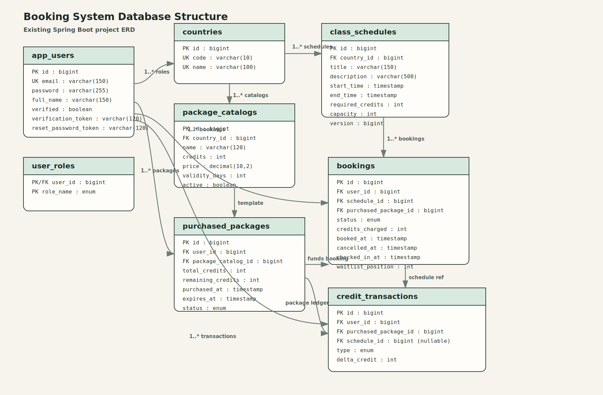

# Booking System API

Spring Boot based mobile booking system API with JWT authentication for users, Basic Auth for admin endpoints, PostgreSQL for persistence, Redis for booking locks/cache, and Quartz for scheduled refund handling.

## Features

- User registration, email verification, login, and reset password
- Admin setup for countries, package catalogs, and class schedules
- Package purchase flow with credit balance tracking
- Class booking with capacity check and waitlist support
- Booking cancellation, refund rules, and class check-in
- Credit ledger history for package usage and refunds
- Swagger / OpenAPI documentation

## Tech Stack

- Java 21
- Spring Boot 3
- Spring Security
- Spring Data JPA
- PostgreSQL
- Redis
- Quartz Scheduler
- JWT
- Swagger UI

## Project Structure

```text
src/main/java/com/testing/bookingsys
|- config        -> security, swagger, quartz, cache configuration
|- controller    -> REST API endpoints
|- dto           -> request / response models
|- entity        -> JPA entities mapped to database tables
|- enums         -> status and role enums
|- exception     -> custom exceptions and global handler
|- integration   -> mock payment and email gateways
|- repository    -> Spring Data repositories
|- scheduler     -> Quartz job classes
|- security      -> JWT generation and authentication filter
|- service       -> business logic
|- util          -> helper utilities
```

## Main API Areas

### Auth

- `POST /api/auth/register`
- `POST /api/auth/verify-email`
- `POST /api/auth/login`
- `POST /api/auth/reset-password/request`
- `POST /api/auth/reset-password/confirm`

### User

- `GET /api/users/me`
- `POST /api/users/change-password`

### Packages

- `GET /api/packages/catalog/{countryCode}`
- `POST /api/packages/purchase`
- `GET /api/packages/me`

### Schedules and Bookings

- `GET /api/schedules/{countryCode}`
- `POST /api/schedules/{scheduleId}/book`
- `POST /api/bookings/{bookingId}/cancel`
- `POST /api/bookings/{bookingId}/check-in`
- `GET /api/bookings/me`

### Admin

- `POST /api/admin/countries`
- `POST /api/admin/packages`
- `POST /api/admin/schedules`

## Authentication

### User APIs

- Login returns a JWT bearer token
- Send it as `Authorization: Bearer <token>`

### Admin APIs

- Admin endpoints use HTTP Basic Auth
- Default credentials come from environment variables:
  - username: `admin`
  - password: `admin123`

## Environment Variables

Copy `.env.example` to `.env` and adjust values if needed.

```env
POSTGRES_DB=bookingsys
POSTGRES_USER=postgres
POSTGRES_PASSWORD=postgres

DB_URL=jdbc:postgresql://127.0.0.1:5433/bookingsys
DB_USERNAME=postgres
DB_PASSWORD=postgres

REDIS_HOST=127.0.0.1
REDIS_PORT=6379

BASIC_AUTH_USERNAME=admin
BASIC_AUTH_PASSWORD=admin123
```

## Run with Docker Services

This project includes Docker Compose for PostgreSQL and Redis.

```bash
docker compose up -d
```

Services from [docker-compose.yml](/c:/Testing/bookingsys/docker-compose.yml):

- PostgreSQL on `localhost:5433`
- Redis on `localhost:6379`

## Run the Application

If you have Maven installed:

```bash
mvn spring-boot:run
```

If your Maven wrapper is working locally:

```bash
./mvnw spring-boot:run
```

## API Documentation

Swagger UI:

```text
http://localhost:8080/swagger-ui.html
```

OpenAPI JSON:

```text
http://localhost:8080/v3/api-docs
```

## Business Flow

1. Admin creates country, package catalog, and class schedules.
2. User registers and verifies email.
3. User logs in and receives JWT.
4. User purchases a package and gets credits.
5. User books a class using available package credits.
6. If the class is full, the user is placed on the waitlist.
7. Cancellation and waitlist expiration can refund credits based on the rules in the service layer.

## Database Diagram



Detailed notes are available in [docs/database-design.md](/c:/Testing/bookingsys/docs/database-design.md).

## Notes

- Email verification and payment are currently mocked through `MockGatewayService`
- Reset password token generation is logged by the application for local development/testing
- Redis is used to reduce double-booking risk with short-lived booking locks

