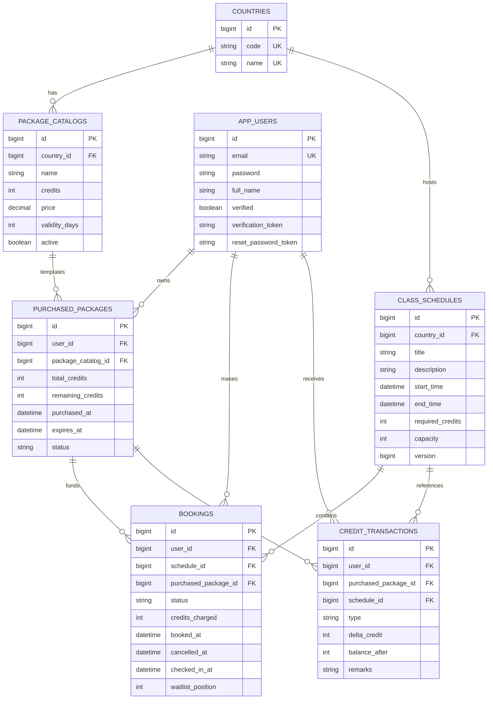

# Database Design Diagram

Rules covered by this schema:

- Package catalog belongs to exactly one country.
- Purchased package inherits credit amount and expiration snapshot.
- Booking always points to the package whose credits were reserved or refunded.
- Waitlist is modeled through `BOOKINGS.status = WAITLISTED` with FIFO via `waitlist_position`.

Downloadable file:

- docs/database-structure.svg`r

